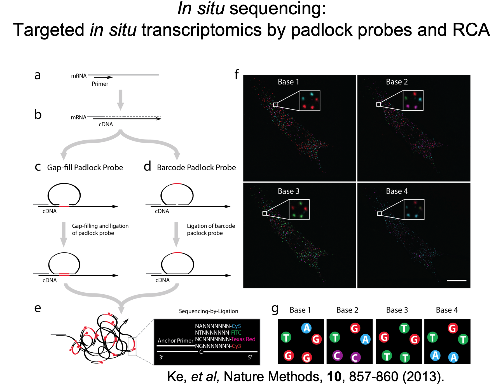
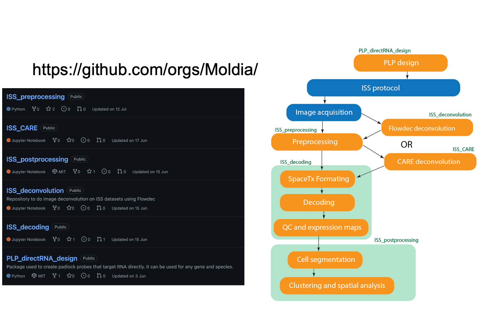

# Schematic workflow  

# General information  
The In Situ Sequencing (ISS) unit offers spatially resolved gene expression analysis for targeted panels of genes at subcellular resolution. Developed in the lab of [Mats Nilsson](http://www.scilifelab.se/researchers/mats-nilsson/), a pioneer in generating in situ gene expression and mutation profiles (Ke R et al., 2013, Nature Methods), ISS provides a cutting-edge approach to spatial transcriptomics.  

**Key Features of ISS:**  

- **Preservation of Spatial Context:** Maintains the spatial organization of gene expression within the tissue architecture.  
- **Targeted Approach:** Utilizes padlock probes for precise gene targeting.
High Specificity: Employs advanced amplification methods for enhanced molecular specificity.  
- **Multiplexing Capability:** Detects up to several hundred transcripts per sample.
Adjustable Sensitivity: Sensitivity can be fine-tuned to match experimental needs.
High Throughput: Achieved through wide-field imaging technology.  

ISS enables simultaneous localization and quantification of over 100 transcripts with subcellular resolution in a single tissue section, providing an unparalleled view of gene expression in its native spatial context.  

# Workflow and Integration  

## In house ISS workflow   
[In house ISS workflow](https://github.com/Moldia) is developed to analyse data generated by in house ISS technique.  
:  

## Niche Identification  
[NicheCompass]('./Codes/Workflows/NicheCompass/): This workflow, developed by NBIS, is a nextflow pipeline which runs [NicheCompass](https://nichecompass.readthedocs.io/en/latest/index.html) which is a package for end-to-end analysis of spatial multi-omics data, including spatial atlas building, niche identification & characterization, cell-cell communication inference and spatial reference mapping.  

## PLP probe design  
In [this portal](https://r35a6f033.serve.scilifelab.se/), you can design your probes of interest for _in situ_ seuqencing, develeoped by NBIS.  
