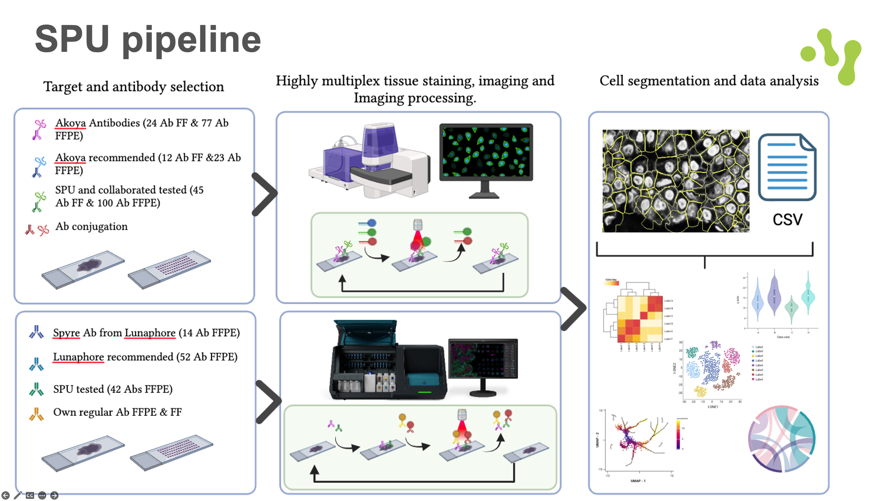
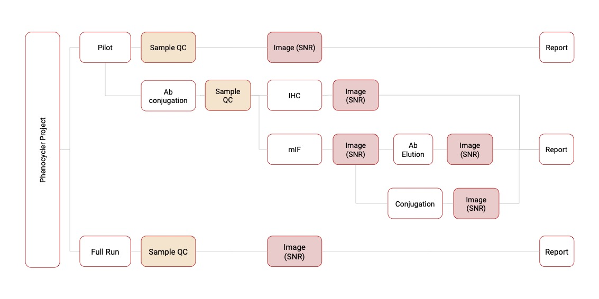
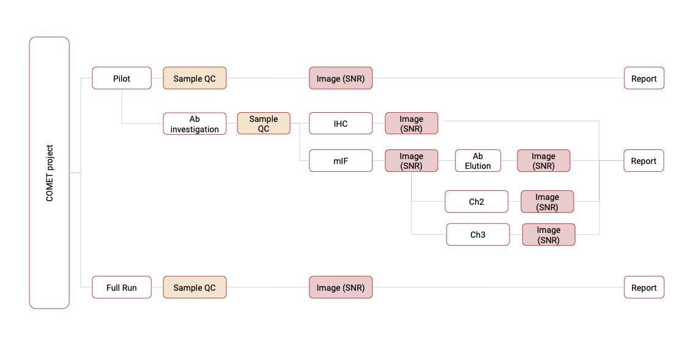

# Schematic workflow  
   

# General information  
Our unit specializes in providing highly multiplexed immunofluorescence services for tissue sections, offering up to 40 markers per sample. As one of the few labs in Europe, we utilize the advanced Phenocycler platform (formerly CODEX), which supports both fresh frozen (FF) and formalin-fixed paraffin-embedded (FFPE) tissue sections from mouse and human samples. We offer access to the complete range of pre-conjugated antibodies from Akoya Biosciences, with the full list available [here]. Additionally, we provide custom in-house antibody conjugation for essential targets specific to your project needs.    

We also offer multiplexing services using the COMET instrument from Lunaphore. This technology leverages sequential immunofluorescence (IF) with readily available primary antibodies. Together, we will evaluate your project’s requirements to determine the most suitable multiplexing method for your research.   

Our unit further provides access to the extensive resources and expertise of the Human Protein Atlas (www.proteinatlas.org). We support full-service immunofluorescence projects, ranging from moderate to high throughput, focused on cell lines. Leveraging a library of over 25,000 antibodies and a diverse panel of more than 30 human cell lines, we offer a unique opportunity to investigate hundreds of protein targets at the subcellular level under various cellular conditions and states.   
Followings are schematic workflow of analysis in two techniques (Phenylcycler and COMET)  

  

  

# Workflow and Integration  
## Automating the export of images for each biomarker in QuPath  
- A script for QuPath to export and save each biomarker in an independent file.  
- Code is available [here](./Codes/Scripts/Extracting_multichannel_images.groovy) 
- A [video](https://youtu.be/802NyI9pbeA?si=17kpN-bibHgxVvc4) demonstrating the code


  
## is-PLA  
Advanced in situ proximity ligation technologies, developed by [Navinci](https://navinci.se/technology/), are expanding the potential of fluorescence-based in situ methods, enabling the detailed visualization and quantification of proteins, their interactions, and modifications at the molecular level within their native cellular environments. These techniques allow for the detection of even low-abundance proteins without the need for overexpression or artificial modification of the cell. The resulting high-resolution images are well-suited for quantification, providing critical insights into biological mechanisms in normal and diseased tissues, cellular responses to therapeutic treatments, and changes within the microenvironment.  

In this section, a dedicated pipeline is provided for extracting signals from the images and intersecting or overlapping them with other biomarkers within the same multiplexed experiment. This integration allows researchers to explore spatial relationships and co-expression patterns, unlocking deeper insights into the complexity of tissue microenvironments.  
## Signal-to-Noise Ratio (SNR) Calculation Workflow  
This script provides a streamlined approach to calculate the [Signal-to-Noise Ratio (SNR)](https://github.com/adyprat/akoya_webinar_0622/blob/main/notebooks/Step2-SNR.ipynb), developed by [Aditya Pratapa](https://www.linkedin.com/in/adyprat/) from Akoya Bioscience Inc.,  in spatial proteomics data, based on fluorescence intensity measurements. The workflow, detailed in the linked Jupyter Notebook (Step2-SNR.ipynb), guides users through the process of importing data, identifying signal regions of interest (ROI), and defining background areas for noise estimation.  

